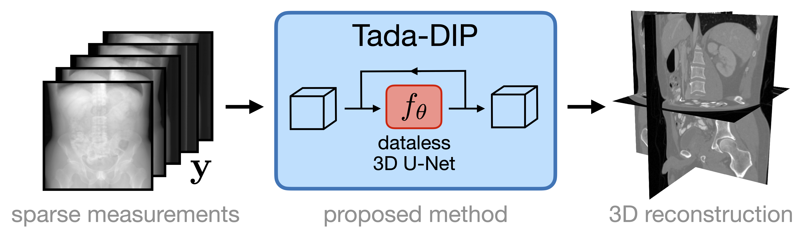

# Tada-DIP: Input-adaptive Deep Image Prior for One-shot 3D Image Reconstruction

This repository contains code to reproduce the main results of the paper ["Tada-DIP: Input-adaptive Deep Image Prior for One-shot 3D Image Reconstruction,"](https://arxiv.org/abs/2512.03962) as presented at the 2025 Asilomar Conference on Signals, Systems, and Computers.

### Data and environment set up
The data used for evaluating each of the methods comes from the 2016 AAPM Low Dose CT Grand Challenge Dataset, and is publicly available [here](https://aapm.app.box.com/s/eaw4jddb53keg1bptavvvd1sf4x3pe9h/folder/144226105715). The conda environment need to run experiments can be created with `conda env create --file environment.yml`, which will create the environment `tada-dip`. The final necessary installation is [LEAP](https://github.com/LLNL/LEAP), which supplies the X-ray projectors. In order to install LEAP, one may first need to install the NVIDIA CUDA toolkit (e.g. `conda install nvidia::cuda-toolkit`).

### Image reconstruction with Tada-DIP
The main results of the paper can reproduced by running `scripts/tada-dip.py`, being sure to set appropriate file paths for the data to be loaded and results to be saved. The three volumes we used for evaluation were `L067`, `L096`, and `L143`.

### Implementation of baseline methods

**FBP.**&nbsp;&nbsp;&nbsp;&nbsp;We computed the FBP using LEAP, which is implemented in our code with the `A_pinv` method of the `physics.PBCT` class for parallel beam reconstruction.

**TV.**&nbsp;&nbsp;&nbsp;&nbsp;For the total variation baseline, we used the ASD-POCS routine, as [implemented in LEAP](https://leapct.readthedocs.io/en/stable/iterative_reconstruction.html#leapctype.tomographicModels.ASDPOCS), with `numIter=500, numSubsets=30, numTV=50`.

**Vanilla DIP.**&nbsp;&nbsp;&nbsp;&nbsp; The same script (`scripts/tada-dip.py`) can also be used to run Vanilla DIP experiments with the hyperparameters set as $\alpha=\beta=\gamma=0$.

**Supervised U-Net.**&nbsp;&nbsp;&nbsp;&nbsp;The supervised baseline is a 2D U-Net, which was trained using the complete Mayo Clinic/AAPM CT dataset available at the [Cancer Imaging Archive](https://www.cancerimagingarchive.net/collection/ldct-and-projection-data/). The exact training configurations are included in the `configs` folder. For training, the data should be processed using the `process_data.py` and `make_fbp_dataset.py` scripts. Then, model training proceeds using the PyTorch Lightning command line interface. For example, to train the model for 15 view reconstruction, one should run `python scripts/train.py fit -c configs/fbp_unet_2d_15_views.yml`. We also release pretrained model checkpoints for both 15 view and 30 view reconstruction [here](https://drive.google.com/drive/folders/1W30aKB56EEz7PYJb3XjOJ5eNQ4vevKpW). The pretrained models can be loaded with `FBPUNet.load_from_checkpoint('checkpoint_path.ckpt', map_location='cpu')` after importing `FBPUNet` from `src.models.fbp_unet`.
